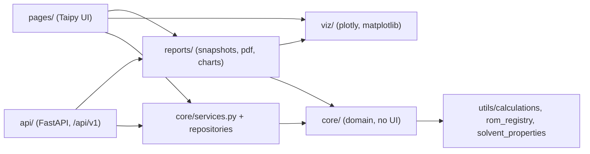
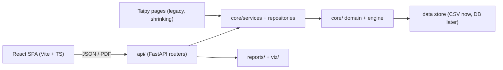

# Modularization roadmap: FastAPI back end + React front end

Status date: 2026-10-07. This plan follows on from the "Option 2" refactor (Parts 1–4). **P0 and P1 are complete. P2 page migration is complete:** the React app (`web/`) at `/app` covers every page: Home, Equations Reference, Unit Converter, all four databases, Recorded Results, Vessel Assessment, Vessel Comparison, Heat Transfer, Bourne Protocol, Reaction Sensitivity Protocol and the Crystallization Sensitivity placeholder. Slow API results are cached. Remaining: user sign-off, then retire Taipy (step 11). See the P2 section.

## Where we are



**Done:**

- **Domain logic in `core/`** (Taipy-free):
  - operating point, envelope, solve/sweep/surface;
  - sensitivity rules, Bourne plan and I/O, scale-up, heat transfer, vessel import diff, miscibility.
- **Typed contracts.** `core/schemas.py` (pydantic) defines `PointRequest/Result`, `Solve/Sweep/Surface`, `ProtocolRequest/Result`, `ComparisonRequest`, `BourneReportRequest`, `HeatCoolRequest` and `ReactionProfileRequest`.
- **Stateless services.** `core/services.py` provides `evaluate`, `solve`, `sweep`, `surface`, `assess`, `compare`, `bourne_evaluation` and `heat_transfer_inputs`.
- **Structured output.** Rule output uses `Message`/`Finding`/`Action` objects, and enum codes are kept separate from display labels (`core/options.py`).
- **Charts.** Chart builders live in `viz/` and return `go.Figure`. `reports.service.figure_json` serialises them for react-plotly.
- **PDF reports.** All six reports go through `reports.service.render_report(kind, payload)`. When Chrome is missing, charts fall back to matplotlib.
- **Safety net.** Golden page outputs, golden report snapshots and contract tests: 787 tests in total.
- **P0 (2026-10-06).**
  - Every page computation has a service.
  - The databases go through validated repositories.
  - Admin login is server-side and fails closed.
  - Pages no longer import the calculation engine, and a test enforces the layer rules.
  - 812 tests in total.
- **P1 (2026-10-06).**
  - A FastAPI app (`api/`) exposes every service, database, report, chart, media file and reference table under `/api/v1`, with admin bearer tokens.
  - Pages no longer import plotly.
  - Media lookup, vessel capacity geometry and unit conversion live in `core/`.
  - The PDF builder moved to `reports/pdf.py`.
  - 838 tests in total.

**Still coupled to Taipy or not exposed as a service:**

| Area | Remaining coupling |
|---|---|
| Database pages (vessel, fluid, reaction, particle, recorded results) | ~~CRUD, validation, search and filtering live in page callbacks that call `save_csv`/`append_csv` directly. There are no record schemas and no repository layer.~~ **Resolved in P0:** `core/repositories.py` + record schemas. Pages keep only the Taipy table plumbing. |
| Interactive computations | ~~Pages still import the engine directly; HT, Bourne and fluid blend work have no contract.~~ **Resolved in P0:**<br>• `core/catalog.py`, `core/fluids.py` and new services in `core/services.py`.<br>• `tests/test_p0_seams.py::test_layer_boundaries` blocks direct engine imports from `pages/`. |
| Figures | ~~Five pages still import plotly.~~ **Resolved in P1:** placeholders come from `viz/common.empty`. Every chart is also available as Plotly JSON from `POST /api/v1/charts/{kind}`. |
| Vessel media / schematic | ~~Both return ready-made HTML.~~ **Resolved in P1:** `core/media.vessel_media()` returns `{kind, url, mime, caption}`; `core/vessel_capacity.py` holds the capacity curve, fill level and impeller warnings. The API serves the media file, a PNG schematic and the fill-state JSON. The Taipy HTML builders stay in `pages/_vessel_media.py`. |
| Auth | ~~The admin gate is a username/password check inside the page, with a **hard-coded default password**.~~ **Resolved in P0:** `core/auth.py` reads credentials from the environment only and fails closed. Write permissions are enforced in the repositories. |
| Static and utility pages | ~~The Unit Converter, Equations Reference and Home pages hold their logic or content inside Taipy Markdown.~~ **Resolved in P1:** `core/units.py`, `GET /equations`, and `GET /version` (from `core/version.py`). |
| `utils/` package | **Partly resolved in P1:**<br>• The PDF builder moved to `reports/pdf.py`; the menu icons moved to `pages/_menu_icons.py`.<br>• The engine modules stay in `utils/` but are held to core rules by `test_layer_boundaries`.<br>• `utils/usage.py` (the SQLite logger) is shared by the Flask hook and the API middleware. |
| Server | **Resolved in P1:** `uvicorn api.main:app` runs next to the Taipy app. `app.py` is unchanged. |

## Target architecture



**Rules:**

- `core/` never imports `taipy`, `plotly`, `fastapi` or `pages`.
- `api/` and `pages/` are thin adapters over the same services.
- Every response is JSON-serialisable through `core.serialize.jsonable` or a pydantic model.

## Plan, in priority order

Each step keeps the Taipy app working and the golden tests passing, so the migration can stop at any point.

### P0: finish the back-end seams (needed before any React work)

> **Status: done (2026-10-06).** Steps 1–3 below are complete. What was delivered is listed under each step. All golden page and report outputs are unchanged; the only intended behaviour changes are listed in [README_code_changes.md §14](README_code_changes.md).

**1. Service contracts for every remaining interactive computation.**

- **Heat Transfer.** Add requests and services for batch heat/cool, reaction profile, UA-vs-RPM and UA-vs-volume sweeps, and the U/UA surface. Reuse `heat_transfer_inputs`.
- **Bourne Protocol.** Move the page's private helpers (condition tables, KPI assessment, summary) behind services:
  - `bourne_plan(system)`
  - `bourne_test_conditions(test_n, ...)`
  - `kpi_assessment` (already partly done)
  - `bourne_outcome`
- **Fluid DB blend.** Add `blend_properties(components)`, `blend_phases(components)` (already in `core.miscibility`) and `property_curves`.
- **Vessel Comparison.** Expose the heat-balance and correlation-source availability (`available_modes_multi`) through `core/services`.
- **Remove direct engine imports from `pages/`.** Drop `utils.calculations`, `utils.rom_registry` and `utils.solvent_properties` imports. Option lists such as `list_solvents` and `available_modes` become `core/services.options_*()` functions.
- **Tests.** Add a contract test per service that is checked against `tests/golden/page_outputs.json`, as `tests/test_contracts.py` already does.
- **Lock it in.** Add an import-rule test (or `import-linter`) that fails if `pages/` imports `utils.calculations`, or if `core/` imports `taipy` or `plotly`.

*Delivered:*

| Area | Services (`core/services.py`) | Contracts (`core/schemas.py`) | Logic moved out of the page |
|---|---|---|---|
| Heat Transfer | `heat_cool`, `reaction_profile`, `ua_surface` | `HeatCoolResult`, `ReactionProfileResult`, `UaSurfaceRequest/Result`, `Coefficients`, `Resistance`, `HeatTransferResolved` | Sweep-parameter map, now `core.heat_transfer.SWEEP_PARAMETERS` |
| Bourne Protocol | `bourne_plan`, `bourne_assess` (and the existing `bourne_evaluation`) | `BournePlanRequest/Result`, `BourneAssessRequest/Result`, `BourneTestOut`, `SpeedSetpoint`. `BourneReportRequest` now extends `BourneAssessRequest`. | Per-test verdict text and the decision-tree summary, now `rules.bourne_test_verdict` and `rules.bourne_summary_md` |
| Fluid DB | `solvent_state`, `blend` | `SolventStateRequest`, `BlendRequest/Result`, `BlendPair` | The whole blend calculation (mixing rules, pair miscibility, settled phases, dispersion screen), now `core/fluids.py`. The page only formats. |
| Vessel Comparison | `scale_up_match` | `ScaleUpRequest/Result`, `ScaleUpRow` | Scale-up matching and the heat summary, now `scale_up.scale_up_match` and `scale_up.heat_summary_data` |
| Option lists | `options()` | `OptionsResult`, `OptionItem` (code + label for every `core.options` enum) | `core/catalog.py`: reactor, reaction, fluid and particle names, plus solvent lookups and correlation sources. `options()` reads them live; the Taipy pages still build their lists once at import. |

*Tests:* [tests/test_p0_seams.py](../tests/test_p0_seams.py) contains:

- service consistency checks against the core calculations;
- the `test_layer_boundaries` import rules:
  - `pages/` must not import `utils.calculations`, `utils.rom_registry` or `utils.solvent_properties`;
  - `core/` must not import `taipy`, `plotly`, `matplotlib`, `pages`, `viz`, `reports` or `fastapi`;
  - `viz/` and `reports/` must not import `taipy` or `pages`.
  - *Extended in P1:*
    - `pages/` must also not import `plotly`, `matplotlib` or `fastapi`;
    - `api/` must not import `taipy` or `pages`;
    - `utils/` (the engine) must not import any UI or API layer.

**2. Data layer: record schemas and repositories.**

- **Record schemas.** Add pydantic models in `core/schemas.py`: `Reactor`, `Reaction`, `Particle`, `Fluid` and `RecordedResult`.
  - Fields mirror the CSV columns.
  - Friendly labels come from the existing column maps.
  - Validation reuses `utils/validation.py`.
- **Repositories.** Add `core/repositories.py` with `list`, `get`, `create`, `update`, `delete`, `search(field, op, value)` and `import_preview`/`import_apply`, built on `core.csv_store` and `core.vessel_import`.
  - The mtime cache and atomic writes stay as they are.
  - The rest of the code depends only on the repository interface, so switching to SQLite or Postgres later only changes one module.
- **Move page logic into the repositories:**
  - search/filter (`filter_rows`, `_numeric_series`, and stripping thousands separators);
  - ID assignment and `search_name` generation;
  - recorded-results append and clear.
- **Fix the option-list snapshot limit.** Option lists come from repository calls, so they are no longer frozen at import time.

*Delivered:*

- **[core/tables.py](../core/tables.py).** The framework-free frame helpers moved here from `pages/_db_common.py`:
  - tolerant CSV import (now also accepts raw upload bytes);
  - inline edit, delete and add-blank;
  - `search(df, query, columns, op)`, with numeric `= < <= > >=` comparisons that tolerate thousands separators;
  - the friendly column labels.

  `pages/_db_common.py` re-exports these helpers, so the existing imports keep working.
- **[core/repositories.py](../core/repositories.py).** Instances `reactors`, `reactions`, `particles`, `fluids` and `results` provide:
  - `load`, `shared` (the mtime-cached frame), `names`, `get`, `index_of` and `search`;
  - `create` (validated; rejects duplicate names; custom fluids may not reuse a library solvent name);
  - `edit`, `update`, `delete`, `add_blank` and `replace` (import).

  `ReactorRepository` keeps reactor IDs and search names in step and adds `import_changes`/`apply_import`. `ResultsRepository` adds `append`/`clear`, plus `filter_results`/`result_counts`.
- **Errors.** `ValueError` means invalid input (422), `LookupError` an unknown name (404), and `PermissionError` a refused write (403).
- **Record schemas.** `ParticleRecord`, `ReactionRecord`, `FluidRecord` and `ReactorRecord` (extra columns allowed) live in `core/schemas.py`. `validation_message()` turns a pydantic error into one readable line with the friendly field label.
  - `ReactionRecord` derives `t_rxn_s` from k (and C0) the way the old add-form did.
  - Particle sizes must satisfy d10 ≤ d50 ≤ d90.
- **Pages rewired.** All four database pages and Recorded Results now go through the repositories, and so do the Vessel Assessment and Vessel Comparison “save result” actions.
- **Option lists.** The analysis pages read their option lists from `core/catalog.py` instead of their own `pd.read_csv` calls.
- **Not yet:**
  - ~~The RecordedResult schema.~~ **Done in P1:** `RecordedResult` (snake_case fields, CSV headers as aliases, `RESULT_COLUMNS`). `ResultsRepository.append` validates every saved row.
  - Live option lists in the Taipy pages. The lists come from the repositories but are still built once at import. React and the API get live lists through `options()`, so this is not worth fixing in Taipy.

**3. Server-side authentication and authorisation.**

- Remove the hard-coded default admin password. Require the env vars and fail closed if they are missing.
- Define one `authorize(user, action)` hook in the service layer. Write operations (DB edits, imports, clearing recorded results) must call it.
- For the API, use a session or JWT, or the corporate SSO/reverse-proxy identity header. Never trust a client-side flag.

*Delivered:*

- **[core/auth.py](../core/auth.py).**
  - Credentials come only from `MIXING_LAB_ADMIN_USER` / `MIXING_LAB_ADMIN_PW`, compared in constant time.
  - With either variable unset, admin login is **disabled** and the page says so.
  - `login()` returns a `Principal`; `authorize(principal, table)` raises `PermissionError`.
- **Write policy (decided 2026-10-06).** `PROTECTED_TABLES = {reactors, reactions, particles, fluids}`: the shared reference tables need admin for every write, including import. **Recorded results stay open**, because they belong to the local user (saving and “clear all” need no login).
  - The repositories enforce the policy, so it also covers the Reaction “Add reaction” form, which previously bypassed the lock.
  - The Particle and Custom Fluid pages gained the same Admin panel as the Vessel and Reaction pages (`db.ADMIN_PANEL_MD`).
- **Taipy gotcha found along the way.** Taipy resolves `state.<var>` from the *calling module's* frame. Shared helpers in `pages/_db_common.py` therefore must not read or write `state`. They return values (`unlock_attempt`, `as_principal`), and each page's `on_admin_unlock` / `on_admin_lock` assigns them.

### P1: HTTP API alongside Taipy

> **Status: done (2026-10-06).** Steps 4–8 below are complete. What was delivered is listed under each step. Golden outputs are unchanged. Every vessel schematic (180 renders) and Unit Converter result (483 cases) was compared byte-for-byte before and after the moves. Behaviour changes are listed in [README_code_changes.md §15](README_code_changes.md).

**4. FastAPI skeleton (`api/`).**

- **Routers** (all reuse the existing pydantic contracts):

| Router | Purpose |
|---|---|
| `/vessels` | Database pages |
| `/fluids` | Database pages |
| `/reactions` | Database pages |
| `/particles` | Database pages |
| `/results` | Recorded results |
| `/assessment` | Point, solve, sweep, surface |
| `/comparison` | Vessel comparison |
| `/bourne` | Bourne protocol |
| `/sensitivity` | Mixing sensitivity |
| `/heat-transfer` | Heat transfer |
| `/reports/{kind}` | `render_report`, returns `application/pdf` |
| `/options` | Enums and labels from `core/options.py` |

- **Error mapping:** `LookupError` maps to 404 and `ValueError` maps to 422. Add CORS settings, a health check and a version endpoint.
- **Media:** serve `images/` and `assets/` as static files with the same cache headers that `app.py` sets today.
- **Usage logging:** port it to middleware (`utils/usage.py` is Flask-specific).
- **Hosting:** run it as its own uvicorn process, or mount it next to Taipy behind the reverse proxy (`/api/*` to FastAPI, everything else to Taipy).
- **Tests:** use `TestClient` to replay every golden scenario through HTTP and assert parity.
- **Types for React:** export the OpenAPI schema and generate TypeScript types with `openapi-typescript`. Commit the generated file or regenerate it in CI.

*Delivered:*

- **Run it:** `uvicorn api.main:app --port 8000`. Interactive docs are at `/api/v1/docs`, the schema at `/api/v1/openapi.json`. `app.py` (Taipy) is unchanged and runs side by side.
- **Files:**
  - [api/main.py](../api/main.py): app factory, error mapping, CORS, gzip, static mounts, usage middleware, `/health`, `/version`, `/auth/login`.
  - [api/security.py](../api/security.py): signed, 8-hour bearer tokens.
  - [api/routers/databases.py](../api/routers/databases.py): one CRUD router per table, plus recorded results.
  - [api/routers/calculations.py](../api/routers/calculations.py).
  - [api/routers/outputs.py](../api/routers/outputs.py): reports, charts, media, equations.
- **Routes** (all under `/api/v1`):

| Area | Routes |
|---|---|
| Meta / auth | `GET /health`, `GET /version`, `POST /auth/login` → `{access_token}` |
| Databases | `/vessels`, `/reactions`, `/particles`, `/fluids/custom`, each with:<br>• `GET ""` (list + `q`/`field`/`op` search)<br>• `GET /names`, `GET /columns`, `GET /export` (CSV)<br>• `GET` / `PATCH` / `DELETE /{name}`, `POST ""`<br>• `PUT /import` (replace); vessels use `POST /import/preview` + `POST /import/apply` (merge review) instead |
| Recorded results | `GET /results` (filters + counts), `GET /results/export`, `POST /results`, `DELETE /results` |
| Calculations | `POST /assessment/{point,solve,sweep,surface}`<br>`POST /sensitivity/assess`<br>`POST /comparison`, `POST /comparison/scale-up`<br>`POST /bourne/{plan,assess}`<br>`POST /heat-transfer/{heat-cool,reaction-profile,ua-surface}`<br>`GET /fluids/library`, `POST /fluids/{solvent-state,blend}`<br>`GET /units`, `POST /units/convert`<br>`GET /options` |
| Outputs | `POST /reports/{kind}` (PDF), `POST /charts/{kind}` (Plotly JSON) |
| Reference | `GET /media/vessels/{name}`, `GET /media/vessels/{name}/fill`, `GET /media/vessels/{name}/schematic.png`, `GET /equations` |
| Static | `/vimages/...`, `/vassets/...`: same URLs as Taipy, cached for 1 day, gzip |

- **Errors:**
  - `LookupError` → 404, `ValueError` and pydantic errors → 422, `PermissionError` → 403.
  - A missing or expired token → 401; admin not configured → 503 on login.
  - Anything else → a generic 500, with the traceback only in the server log.
- **Security:**
  - Uploads are limited to 5 MB.
  - Media IDs are restricted to `[A-Za-z0-9_.-]` with no `..`.
  - Static mounts cover only `images/` and `assets/`; repo files return 404 (tested).
  - CORS is off unless `MIXING_LAB_CORS_ORIGINS` is set.
  - Set `MIXING_LAB_API_SECRET` so tokens survive restarts.
- **Usage logging:** the middleware logs each `/api/v1` call as page `api:<METHOD> <path>` to the same `data/usage.db`.
- **Tests:** [tests/test_api.py](../tests/test_api.py) (22 tests) checks:
  - HTTP JSON equals the service results, which `test_contracts` ties to the page goldens;
  - every chart kind;
  - the PDF report;
  - auth (login, 401, 403, 503);
  - CRUD on temp copies of the CSVs, and the vessel import review;
  - the upload limit, hidden 500 details, media and static traversal, CORS;
  - an **OpenAPI snapshot**.
- **Types for React:** `python scripts/export_openapi.py` writes [api/openapi.json](../api/openapi.json). Generate the TypeScript types from it with `npx openapi-typescript api/openapi.json -o src/api/schema.d.ts`. The snapshot test fails when a route or contract changes without regenerating.
- **Still open:**
  - Mounting behind a reverse proxy, and SSO identity headers. Decide at deployment time.
  - The schematic as SVG/JSON geometry: PNG and fill data are served today.

**5. Charts as data.**

- Move the remaining in-page figure code (fluid blend phase figure, HT and Bourne leftovers) into `viz/`. After that, no page imports plotly.
- Chart endpoints return `figure_json(fig)` (react-plotly.js renders it directly). Optionally they can return raw series and let React build the figure.
- Keep `env-rows-N` and height hints in the response metadata, not in CSS class names.

*Delivered:*

- **No page imports plotly any more.** The empty placeholder figures come from [viz/common.py](../viz/common.py), and the layer test now bans `plotly` and `matplotlib` in `pages/`.
- **[reports/charts.py](../reports/charts.py).** `CHARTS` / `render_chart(kind, payload)` returns `ChartResult {figures: {name: plotly JSON}, captions, rows}`. Kinds:
  - `assessment-envelope`, `assessment-surfaces`, `comparison-envelope`;
  - `heat-cool` (temperature, duty, resistances, UA vs speed, UA vs volume), `reaction-profile`, `ua-surface`;
  - `bourne-speed-plan`, `solvent-properties`, `blend-phases`.

  The `rows` field is the subplot sizing hint that replaces `env-rows-N`.

**6. Media and schematic as data.**

- `pages/_vessel_media.py` should be split:
  - the media lookup (`find_vessel_media`, caption) goes into a core function that returns `{kind: "3d"|"image", url, caption}`;
  - the HTML builders stay in Taipy-only code.
  - React then renders `<model-viewer>` or `` itself.
- `viz/vessel_schematic.py`: separate the geometry (outline points, liquid level, impeller and baffle boxes, the `brim_volume` capacity curve) into `core/` from the matplotlib rendering. The API can then return JSON geometry (drawn as SVG in React) or a PNG/SVG file.

*Delivered:*

- **[core/media.py](../core/media.py)** provides `find_vessel_media`, `static_url`, `mime_type`, `media_caption` and `vessel_media()`. `pages/_vessel_media.py` keeps only the Taipy HTML builders.
- **[core/vessel_capacity.py](../core/vessel_capacity.py)** provides `geometry()` (outline and capacity curve), `brim_volume`, `fill_state()` (level, fill %, wetted area, impeller wall and level warnings) and `fill_summary()` for JSON.
  - `viz/vessel_schematic.py` now only draws.
  - `build_vessel_schematic(..., as_png=True)` returns PNG bytes for the API.
- **Verification:** all 180 schematic renders (44 vessels × 4 fills) are byte-identical before and after the split.

**7. Reorganise the `utils/` package.**

| Current | New location |
|---|---|
| `utils/calculations/`, `rom_registry`, `rom_templates`, `solvent_properties`, `validation`, `bourne_kpi` | `core/engine/` (or keep as-is, but treat as core: no UI imports) |
| `utils/report_builder.py` | `reports/pdf/` (split per report: assessment, comparison, protocol, bourne, heat transfer) |
| `utils/usage.py` | `api/middleware/usage.py` (plus a Taipy adapter until retirement) |
| `utils/menu_icons.py` | `pages/` (Taipy-only) |

Make each move with `git mv` plus import updates, and require the golden tests to pass after every move.

*Delivered:*

- **Moves** (`git mv`, so history is kept): `utils/report_builder.py` → [reports/pdf.py](../reports/pdf.py), and `utils/menu_icons.py` → [pages/_menu_icons.py](../pages/_menu_icons.py). Dead locals and an unused import flagged by lint were removed. The PDF builder is not split per report yet; it is one module, which can be split when a React page needs it.
- **Engine modules:** `calculations/`, `rom_registry`, `rom_templates`, `solvent_properties`, `validation` and `bourne_kpi` stay in `utils/` to avoid churning about 100 imports. `test_layer_boundaries` holds them to core rules: no `taipy`, `plotly`, `pages`, `viz`, `reports` or `api` imports.
- **`utils/usage.py`** stays as the shared SQLite logger. The Flask hook (Taipy) and the FastAPI middleware both call `log_access`. Delete the Flask hook when Taipy is retired.

**8. Static and utility pages.**

- **Equations Reference:** serve `data/equations_reference.json` as-is from `/equations`.
- **Unit Converter:** move the conversion tables and functions into `core/units.py` and expose `/units/convert`. React can also convert on the client.
- **Home:** becomes static React content. `APP_VERSION` comes from `/version`.

*Delivered:*

- **[core/units.py](../core/units.py)** holds all conversion tables, `convert()`, `units_for()` and `GAS_REFERENCE`. The Unit Converter page now only formats; its output for all 483 property/unit/value cases is identical.
- **`GET /equations`** serves the equations, re-read when the file changes. *(Changed in P2: it now serves the LaTeX source `data/equations_source.json`; see row 1.)*
- **[core/version.py](../core/version.py)** holds `APP_VERSION` and `RELEASE_DATE`, used by the Home page and `GET /version`.

### P2: React migration (strangler pattern)

**9. Make services fully stateless and fast enough to call per interaction.**

- Replace per-session Taipy caches (`_va_cache`, `_vc_cache`, `_ms_cache`) with caches keyed by input hash (`functools.lru_cache` on frozen request models, or Redis on the server).
- Long-running work (3D surfaces, multi-vessel comparisons, PDFs with kaleido) runs as `POST` → job id → poll, or with FastAPI `BackgroundTasks`. Add timeouts.
- **File uploads.** Vessel import, Bourne CSV and DB imports become multipart endpoints that return a preview diff, followed by a separate apply call. This matches the current approve/skip dialog.

*Delivered so far:*

- **[api/cache.py](../api/cache.py)** is an in-process LRU cache with 48 entries.
  - **Keyed on:** the endpoint, the canonical request JSON, and a data version (every `data/*.csv|json` modification time plus today's date, because PDFs print it). Editing any database invalidates all cached results.
  - **Never cached:** errors.
  - **Cached endpoints:** `POST /reports/{kind}`, `POST /charts/{kind}`, `/assessment/surface`, `/comparison`, `/comparison/scale-up` and `/heat-transfer/ua-surface`. A repeated PDF request returns instantly instead of taking about 11 s.
- **Not yet:** background jobs (submit, then poll) for first-time slow requests. *(The Bourne CSV upload endpoint now exists: `POST /sensitivity/bourne-import`, row 9.)*

**10. Build React pages one at a time, starting with the lowest risk.**

| Order | Page | Reason |
|---|---|---|
| 1 | Home, Equations Reference, Unit Converter | Static or read-only; proves routing, theming (Takeda palette), auth and deployment |
| 2 | Particle, Reaction, Fluid DB (tables + CRUD) | Exercises repositories, validation and the admin gate |
| 3 | Vessel DB (+ import review, 3D viewer, schematic) | Uploads, diff review, media |
| 4 | Recorded Results | Filters plus CSV download |
| 5 | Vessel Assessment | Main computation page; point, envelope, surfaces, solve-for, PDF |
| 6 | Vessel Comparison | Multi-vessel, scale-up matching |
| 7 | Heat Transfer | Many charts and sweeps |
| 8 | Bourne Protocol | Multi-step workflow, editable KPI tables |
| 9 | Mixing Sensitivity | 8-step decision tree; depends on Bourne CSV import |
| — | Crystallization Sensitivity | Still a placeholder; build it directly in React when ready |

- Each React page goes live behind the reverse proxy (`/app/<page>`), while the Taipy version stays reachable until users sign off.
- **Front-end stack:** Vite + React + TypeScript, generated API types, TanStack Query for data fetching and caching, react-plotly.js, `@google/model-viewer`, and a table component that supports inline editing (for example AG Grid or TanStack Table).
- **Acceptance per page:** same numbers as the golden scenarios (the API parity tests already guarantee this), PDF parity, and side-by-side UX review.

*Delivered: every row (1–9) and the Crystallization Sensitivity placeholder. Every Taipy page now has a React counterpart; next is user sign-off, then step 11 (retire Taipy).*

- **App:** [web/](../web) uses Vite 8, React 19, TypeScript 5.9 and React Router 7 (base path `/app`). Data comes from TanStack Query 5 through `openapi-fetch`, typed from `api/openapi.json`.
- **Pages:**
  - **Home:** version from `GET /version`.
  - **Equations Reference:** collapsible sections plus a new search box (it also matches the LaTeX source). Markdown is rendered with `react-markdown` + GFM; inline HTML is sanitised.
    - **Equations are real LaTeX now, not images.** `GET /equations` serves `data/equations_source.json`. Display equations are rendered by KaTeX; inline `$...$` goes through `remark-math` + `rehype-katex` (sanitiser first, then KaTeX).
    - The pre-rendered PNG file (`data/equations_reference.json`, built by `scripts/build_equations.py` with matplotlib mathtext) is now Taipy-only. Delete it and the build step when Taipy is retired.
    - The page and KaTeX (JS, CSS, fonts) are lazy-loaded, so the main bundle stays at 98 kB gzipped. The equations chunk is about 260 kB gzipped and triggers Vite's chunk-size warning; this is expected.
  - **Unit Converter:** `POST /units/convert`.
  - **Particle, Reaction and Fluid databases (row 2)** at `/app/particles`, `/app/reactions` and `/app/fluids`. They have the same sections as the Taipy pages, all backed by the P1 table routes.
    - **Shared building blocks:**
      - `components/DataTable.tsx`: sortable, paged; click a cell to edit (Enter saves, Esc cancels); delete asks for confirmation.
      - `components/Database.tsx`: server-side search (`q`, `field`, `op`, including numeric `>`, `<=` …; debounced), the add form, and CSV export/import.
      - `api/tables.ts`: query and mutation hooks for each table.
      - `components/Notice.tsx`: toast showing the server's validation messages.
    - Edits and deletes go by record **name**, not row position, so (unlike Taipy) editing also works while a search is active.
    - **Admin:** `components/Admin.tsx` calls `POST /auth/login`. The token is held **in memory only**, so a reload locks editing again. The token is shared by every page, sent as `Authorization: Bearer` by `openapi-fetch` middleware, dropped a minute before it expires, and dropped on any 401.
    - **Reactions:** separate "Reaction classes" and "Measured kinetics" tables (split on `class`), plus the scheme viewer.
    - **Fluids:** tabs kept in the URL (`?tab=properties|custom|blend|io`).
      - Library: `GET /fluids/library`.
      - Solvent properties: `POST /fluids/solvent-state` plus the `solvent-properties` chart.
      - Custom fluids: CRUD, including the HSP fields.
      - Blend: `POST /fluids/blend` plus the `blend-phases` chart, with the same status lines, miscibility table and dispersion screen as Taipy.
    - **Charts:** Plotly figure JSON from `POST /charts/{kind}` is drawn by `components/Plot.tsx`, which calls `Plotly.react` directly (no `react-plotly.js` wrapper).
      - `plotly.js-dist-min` is pinned to **3.7.0**, the plotly.js version Python plotly 6.9 targets, so figures render as they do in Taipy.
      - Plotly is about 1.4 MB gzipped, so it is lazy-loaded only when a chart is shown. The Fluid page is lazy-loaded too; the main bundle is 100 kB gzipped.
    - **Not ported here:** the Vessel Database (row 3).
  - **Vessel Database (row 3)** at `/app/vessels`:
    - **Database:** the shared `DatabaseTable` (search, numeric filters, inline edit, delete) and an **Add vessel** form for the core geometry (Taipy only added a blank row).
    - **Explore Vessel:** the selected vessel is kept in the URL (`?vessel=`).
      - The 3D model loads `<model-viewer>` from `/vassets` on demand; otherwise the vessel image or a placeholder is shown.
      - Property table with a "Properties to show" multi-select.
      - 2D schematic PNG with a debounced fill volume, clamped to the brim-full volume. The default fill, status line and caption are ports of the Taipy helpers and are unit-tested.
    - **Import:** `POST /vessels/import/preview` → a review dialog (Approve / Skip / Accept all remaining / Cancel) → `POST /vessels/import/apply` with the accepted change IDs. The server recomputes the changes from the same file, so nothing is held between requests.
  - **Recorded Results (row 4)** at `/app/recorded-results`:
    - Reactor, reaction and fluid multi-select filters; the table shows numbers to 4 significant figures, as in Taipy.
    - Summary counts from `GET /results`; CSV export of the filtered set; Refresh; and "Clear all" with an in-page confirmation (no login, per the P0 decision).
  - **Crystallization Sensitivity:** the placeholder page, ported as is.
  - **Vessel Assessment (row 5)** at `/app/vessel-assessment`. It has the same four input cards, results, envelope, 3D surfaces, export/save and Solve-for as Taipy.
    - **New API support** (the page needs no calculation code of its own):
      - `POST /assessment/tables`: the formatted result tables (hydrodynamics, Damköhler, mass transfer, solids, heat), the assessment line and the correlation-applicability text. These are built by the same `reports.tables.assessment_tables` and `rules.correlation_applicability` code as the Taipy page and PDF; a test asserts they are equal.
      - `GET /assessment/parameters`: the envelope / Solve-for parameter list, now one shared list, `core.envelope.ENVELOPE_PARAMETERS`, which the Taipy page imports too.
      - `GET /assessment/vessel-defaults/{name}`: geometry, mid-range N and V, and the vessel's correlation sources with the status text.
      - `GET /fluids/properties`: library-solvent or custom-fluid properties at T and P, resolving aliases.
      - `POST /assessment/save`: append the point to Recorded Results through the shared `services.recorded_result_row`, which the Taipy page now uses too.
    - **Front end:**
      - `pages/assessment/model.ts`: the request builder, the `t_rxn` derivation, the kinetic-model and Solve-for text, and CSV export, all unit-tested against the Python strings.
      - `components/Form.tsx`: number, select, switch and segmented controls.
      - Changing an input after a run shows the “inputs changed” banner and turns Compute red again; the PDF and Save buttons wait for a fresh run.
      - The envelope redraws whenever the parameter selection changes; the 3D surfaces are generated on demand, with a stale banner.
      - The PDF comes from `POST /reports/assessment`; table CSVs are generated in the browser.
  - **Vessel Comparison (row 6)** at `/app/vessel-comparison`. It has the same cards as Taipy: vessels and conditions, the selected-vessel 3D row, options (solids, gas, fed-batch with per-vessel feed pipes and a feed schedule), scale-up matching with per-target known values, all result tables, the envelope chart, PDF and save.
    - **Shared formatting:** the Taipy page's table formatting moved to [reports/comparison_tables.py](../reports/comparison_tables.py). The setup defaults moved to `core.scale_up`: `feed_pipe_defaults`, `basis_defaults`, `target_defaults`, `recorded_rows`, `SCALABLE_PARAMS` and `DEFAULT_PLOT_PARAMS`. The Taipy page now calls them; its golden outputs are unchanged.
    - **New endpoints:**
      - `POST /comparison/setup`: shared correlation sources, feed-pipe IDs, basis and target defaults, and the scalable parameters.
      - `POST /comparison/tables`: every result table plus the status and feed-overflow check (cached).
      - `POST /comparison/save`.
      - `GET /kinetics/defaults?reaction=`.
    - A test drives the Taipy page through its full scenario (solids, sparging, fed-batch, heat, scale-up) and asserts that the HTTP tables equal the page tables.
    - When a scaled feed would overflow a vessel, the page shows the status line, the warning and the feed-plan table, but not the other results (Taipy hid the feed plan too).
  - **Heat Transfer (row 7)** at `/app/heat-transfer`. It has all three modes (heat/cool vessel, reaction temperature profile, U/UA parameter sweep), project information, every geometry, material, fluid, jacket and temperature input, the tables, all 8 charts and the PDF.
    - **API additions:**
      - **Overrides:** `HeatTransferRequest` now accepts optional overrides for every value the page lets users edit: fluid ρ/μ/Cp/k, jacket Cp, wall k, lining k and thickness. Without them the results are unchanged.
      - **Surface colour range:** `UaSurfaceRequest` accepts custom `U_color_range` / `UA_color_range`.
      - **New endpoints:**
        - `GET /heat-transfer/options`: media with Cp, correlations, materials, linings, sweep parameters, unit operations.
        - `GET /heat-transfer/defaults/{vessel}`;
        - `GET /heat-transfer/area`;
        - `GET /fluids/thermal`.
    - **Front end:** the tables come from `/heat-transfer/heat-cool` and `/reaction-profile`, and the figures from `/charts/{heat-cool, reaction-profile, ua-surface}`; each mode's two calls run in parallel. The status, adiabatic, agitator and KPI text are ports of the Taipy strings, unit-tested in `pages/heat/model.test.ts`.
    - A test drives the Taipy page in all three modes, with edited ρ, wall k and jacket Cp and a custom colour range, and asserts the HTTP tables and surface equal the page.
  - **Bourne Protocol (row 8)** at `/app/bourne-protocol`. It has both tabs (Protocol and Plan), project information, the system card with reactor limits and the 3D viewer, the decision-tree image, all three gated tests with editable KPI tables, the summary, the PDF and the Sensitivity CSV.
    - **API additions:**
      - `POST /bourne/plan/tables`: formatted conditions, setpoints and captions, from the new [reports/bourne_tables.py](../reports/bourne_tables.py), which the Taipy page now uses too.
      - `GET /bourne/options`;
      - `GET /bourne/defaults/{vessel}`;
      - `POST /bourne/sensitivity-csv`.
    - **Front end (`pages/bourne/model.ts`, unit-tested):**
      - the request builder;
      - per-test validity keys, matching the Taipy invalidation scopes;
      - KPI completeness, with the Taipy "Skipped incomplete…" and "Enter the low, centre and high…" wording;
      - KPI mirroring to the next test;
      - the fed-batch milestone default (2 × V, then max + V).
    - **Behaviour:** the speed-plan chart is drawn when the vessel has a fill range; otherwise the page shows the single-volume note.
    - **Parity test:** drives the Taipy page through Tests 1–3 with fed-batch volumes and custom feed and ratio inputs. It asserts that the HTTP tables, verdicts, KPI table, summary, CSV bytes and vessel defaults equal the page.
  - **Reaction Sensitivity Protocol (row 9)** at `/app/reaction-sensitivity`. It has Steps 0–7: the Bourne pre-screen with CSV import, kinetics, phases, competing reactions, heat (including the ΔH-source prompt), the optional vessel Damköhler screen, the summary and recommendations, and the PDF. Start, Update and Reset behave as in Taipy.
    - **API additions:**
      - `POST /sensitivity/page`;
      - `GET /sensitivity/options`;
      - `GET /sensitivity/reaction-defaults`;
      - `POST /sensitivity/bourne-import`;
      - `ProtocolReportRequest.bourne_meta`.
    - **Front end (`pages/sensitivity/model.ts`, unit-tested):**
      - the request builder (Taipy's `_sf` semantics);
      - the reaction list for each kinetics answer;
      - reaction auto-fill (C₀ for heat, ρ·Cp);
      - the import patch, which prefills only blank project fields.
    - **Parity test:** imports a real Bourne export into the Taipy page, adds gas, competing reactions, semi-batch and a vessel screen. It asserts that the import, every step's Markdown, the captions, verdict, findings and next steps equal the page, and that the PDF builds with `bourne_meta`.
- **Navigation:** the sidebar follows the Taipy menu order. Every entry now opens a React page. The ↗ fallback to the Taipy app (`VITE_TAIPY_URL`, default `http://127.0.0.1:5000`) remains for any entry without a `path`.
- **Styling:** `web/src/styles.css` reproduces the Takeda look: red `#E1251B` / grey `#5C6670`, white cards with a red left accent, and the centred page logo.
- **Icons:** they come from a new `GET /api/v1/media/icons/{key}?px=` route (cached 96 px thumbnails). The source PNGs are 0.5–1 MB each. The thumbnail cache moved from `pages/_menu_icons.py` to `core/media.thumbnail`.
- **Serving:** FastAPI serves the built app from `web/dist` at `/app`. Any `/app/...` path returns `index.html`, so deep links and reloads work. `/` redirects to `/app/` once the app is built, otherwise to the API docs. `/app` page loads are written to the usage log as `app:<path>`.
- **Verification:**
  - The Unit Converter number format matches Python's `_fmt` on 25 reference values (`web/src/format.test.ts`).
  - Browser results match the Taipy page (pressure and gas-flow cases).
  - The Equations Reference renders all 8 sections: 80 display and 287 inline KaTeX fragments, 0 KaTeX errors, KaTeX fonts loaded, no unrendered `$...$` left, and no console errors.
  - Front-end tests: `npm test` (42 tests, including sanitiser, KaTeX, table sort/paging/edit/delete and token-expiry tests). Back-end tests: 842.
  - Row 2 was tested end to end against an **isolated copy of the repo in /tmp** with throwaway admin credentials, so the real `data/*.csv` stayed untouched. The run covered:
    - login (bad and good password); search, including a numeric search;
    - inline edit; duplicate-name and invalid-value errors from the server;
    - add and delete; editing a fluid named `60% Acetic Acid / 40% Water`;
    - CSV export → import round trip, and locking.
    - Solvent-state values and the blend results (ρ 929.5 kg/m³, μ 0.000714 Pa·s for 50/50 water/toluene) match the Python page format.
    - Both charts render, with no console errors.
  - Rows 3–4 were tested the same way (isolated copy, real data untouched):
    - Vessel explorer: default fill, the Min/Max-volume and impeller-level status lines, the clamp, and the schematic PNG. The 3D model loads with no errors.
    - Import review: approving one change, skipping one and accepting the rest applied exactly the accepted changes and gave the new vessel an ID.
    - Recorded Results: filter counts and the filtered CSV export match, and clear-all works.
  - Front-end tests: 45. Back-end tests: 843.
  - Row 5 was tested the same way:
    - The defaults match Taipy: mid-range N and V, and the first measured reaction with its database t_rxn.
    - Compute renders all tables and the 6-panel envelope.
    - Solve-for: P/V = 1 W/L gave N = 760.4 RPM; Apply + Compute then reported P/V = 1 W/L.
    - 3D surfaces, the PDF (805 kB, correct filename) and Save to Recorded Results all work.
    - Selecting Grignard switches the solvent to THF, and a temperature change reloads its properties. No console errors.
  - Front-end tests: 52. Back-end tests: 844.
  - Row 6 was tested the same way:
    - The 4 default vessels compare; all tables and the envelope chart render.
    - Scale-up: P/V from Cambrex R-101, solving for volume, gives the same Matched / “Not achievable [outside V]” rows as Taipy.
    - Changing the basis reloads the basis RPM/volume and the target defaults.
    - Save stores 4 rows; the PDF is 1.1 MB.
    - Over-feeding shows the overflow warning per vessel.
    - Selecting Grignard switches the fluid to THF. No console errors.
  - Front-end tests: 58. Back-end tests: 845.
  - Row 7 was tested the same way:
    - Heat/cool: vessel defaults (glass wall, k = 1.2), KPIs, 5 charts and the agitator line; a volume change updates the jacket area.
    - Reaction mode: the adiabatic line, the profile chart and the summary.
    - Sweep: vessel bounds load, choosing the same axis swaps the other as in Taipy, and both surfaces render. The custom colour range starts from the automatic limits and rejects max < min.
    - The PDF is returned with the project-name filename. No console errors.
  - Front-end tests: 66. Back-end tests: 846.
  - Row 8 was tested the same way (isolated copy, real data untouched):
    - Start Protocol shows Test 1 and the iso-P/m chart.
    - Fed-batch: a milestone outside the fill range is dropped, as in Taipy; 0.08 L gives "Adj. 1" with the clamped ⚠ marker.
    - Tests 1 and 2 were sensitive and Test 3 was not, giving MACROMIXING. An incomplete KPI row triggers the "Skipped incomplete…" warning, and the Test 2 KPIs were mirrored from Test 1.
    - The PDF and Sensitivity CSV come back with the project-name filenames.
    - A temperature change shows the invalidation status and hides Tests 2–3; restoring it brings the results back.
    - The Plan tab recomputes the conditions.
  - Row 9 was tested the same way:
    - The defaults match Taipy: the first measured reaction, k, C₀ for heat and the solvent ρ·Cp.
    - Importing the Bourne CSV produced by row 8 sets the status to Confirmed and fills the blank project fields and the findings table.
    - Run assessment shows the per-step boxes. Competing = Yes plus the vessel screen gives the Da_micro / Da_macro findings and the "Mixing sensitivity confirmed" verdict.
    - The PDF downloads as `RxnSens_E2E_step3_Reaction_….pdf`, and Reset restores the pre-start state.
  - Front-end tests: 75. Back-end tests: 848.
- **Run it:**

```zsh
conda create -n mixing_lab_web -c conda-forge nodejs=22     # once (Node 22 LTS, separate env)
export PATH=/opt/anaconda3/envs/mixing_lab_web/bin:$PATH
cd web && npm install                                        # once
npm run gen:api      # after `python scripts/export_openapi.py`
npm run dev          # http://localhost:5173/app/ (proxies /api to uvicorn on :8000)
npm run build        # web/dist, then served by `uvicorn api.main:app` at /app
```

- **Note:** `web/node_modules` (about 240 packages) sits inside the OneDrive-synced folder. Consider excluding it from sync, or keep the repo outside OneDrive.

**11. Retire Taipy.**

- Delete `pages/` and the Taipy parts of `app.py`, and drop `taipy-gui` from `requirements.txt`.
- Move deployment from gunicorn with gevent-websocket to uvicorn/gunicorn with uvicorn workers. No WebSocket is needed unless jobs push progress.
- Keep the `.taipyignore` lesson: serve only explicit static folders, never the repo root.

## Cross-cutting items (do these alongside the steps above)

- **CI:** run pytest, pyflakes or ruff, the import-rule test, and the OpenAPI schema diff on every push.
- **Versioning:** version the API (`/api/v1`) and the report snapshot schema, so PDFs and React stay compatible.
- **Data:** decide whether to stay on CSV (single writer, file lock) or move to SQLite or Postgres before multi-user React editing. The repository layer from step 2 makes this a single-module change.
- **Security (OWASP):**
  - validate every input with pydantic;
  - set size limits on uploads;
  - prevent path traversal in media lookups (keep the `images/` root check);
  - never put user input into a file path;
  - require auth on write endpoints;
  - avoid leaking stack traces in 500 responses.
- **Docs:** generate API docs from OpenAPI (`/docs`). Keep `docs/README_code_changes.md` for behaviour changes only.

## Suggested next increment

Row 1 of step 10 and the step-9 cache are done. Next:

1. **Row 2 (Particle, Reaction and Fluid databases):**
   - an editable grid (AG Grid or TanStack Table) on `/particles`, `/reactions` and `/fluids/custom`;
   - an admin login dialog using `POST /auth/login`, with the token kept in memory;
   - CSV import and export;
   - the Fluid Database's solvent-state, blend and phase-chart tabs.
2. **Deployment:** reverse-proxy rules for `/api`, `/app` and `/vimages` to uvicorn, with everything else going to Taipy. Set `MIXING_LAB_API_SECRET` and the admin env vars on the server.
3. **CI:** `pytest`, `npm test`, `npm run typecheck`, and the OpenAPI snapshot check.
