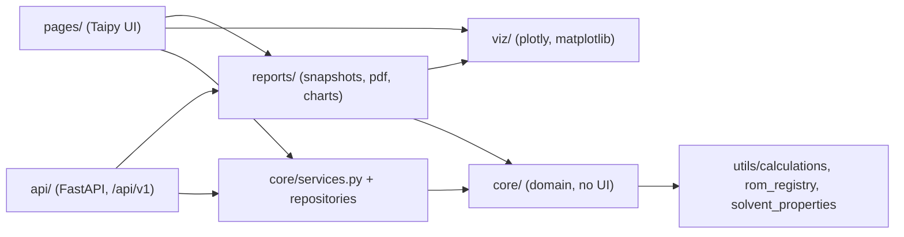
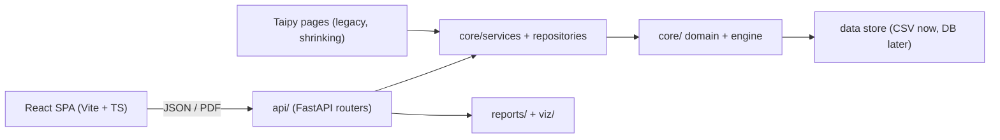

# Modularization roadmap: FastAPI back end + React front end

Status date: 2026-10-06. This plan follows on from the "Option 2" refactor (Parts 1–4). **P0 and P1 are complete** (see each section for what was delivered); P2, the React pages, is next.

## Where we are

**Done:**

- **Domain logic in `core/`** (Taipy-free):
  - operating point, envelope, solve/sweep/surface;
  - sensitivity rules, Bourne plan and I/O, scale-up, heat transfer, vessel import diff, miscibility.
- **Typed contracts.** `core/schemas.py` (pydantic) defines `PointRequest/Result`, `Solve/Sweep/Surface`, `ProtocolRequest/Result`, `ComparisonRequest`, `BourneReportRequest`, `HeatCoolRequest` and `ReactionProfileRequest`.
- **Stateless services.** `core/services.py` provides `evaluate`, `solve`, `sweep`, `surface`, `assess`, `compare`, `bourne_evaluation` and `heat_transfer_inputs`.
- **Structured output.** Rule output uses `Message`/`Finding`/`Action` objects, and enum codes are kept separate from display labels (`core/options.py`).
- **Charts.** Chart builders live in `viz/` and return `go.Figure`. `reports.service.figure_json` serialises them for react-plotly.
- **PDF reports.** All six reports go through `reports.service.render_report(kind, payload)`. When Chrome is missing, charts fall back to matplotlib.
- **Safety net.** Golden page outputs, golden report snapshots and contract tests: 787 tests in total.
- **P0 (2026-10-06).**
  - Every page computation has a service.
  - The databases go through validated repositories.
  - Admin login is server-side and fails closed.
  - Pages no longer import the calculation engine, and a test enforces the layer rules.
  - 812 tests in total.
- **P1 (2026-10-06).**
  - A FastAPI app (`api/`) exposes every service, database, report, chart, media file and reference table under `/api/v1`, with admin bearer tokens.
  - Pages no longer import plotly.
  - Media lookup, vessel capacity geometry and unit conversion live in `core/`.
  - The PDF builder moved to `reports/pdf.py`.
  - 838 tests in total.

**Still coupled to Taipy or not exposed as a service:**

| Area | Remaining coupling |
|---|---|
| Database pages (vessel, fluid, reaction, particle, recorded results) | ~~CRUD, validation, search and filtering live in page callbacks that call `save_csv`/`append_csv` directly. There are no record schemas and no repository layer.~~ **Resolved in P0:** `core/repositories.py` + record schemas. Pages keep only the Taipy table plumbing. |
| Interactive computations | ~~Pages still import the engine directly; HT, Bourne and fluid blend work have no contract.~~ **Resolved in P0:** • `core/catalog.py`, `core/fluids.py` and new services in `core/services.py`. • `tests/test_p0_seams.py::test_layer_boundaries` blocks direct engine imports from `pages/`. |
| Figures | ~~Five pages still import plotly.~~ **Resolved in P1:** placeholders come from `viz/common.empty`. Every chart is also available as Plotly JSON from `POST /api/v1/charts/{kind}`. |
| Vessel media / schematic | ~~Both return ready-made HTML.~~ **Resolved in P1:** `core/media.vessel_media()` returns `{kind, url, mime, caption}`; `core/vessel_capacity.py` holds the capacity curve, fill level and impeller warnings. The API serves the media file, a PNG schematic and the fill-state JSON. The Taipy HTML builders stay in `pages/_vessel_media.py`. |
| Auth | ~~The admin gate is a username/password check inside the page, with a **hard-coded default password**.~~ **Resolved in P0:** `core/auth.py` reads credentials from the environment only and fails closed. Write permissions are enforced in the repositories. |
| Static and utility pages | ~~The Unit Converter, Equations Reference and Home pages hold their logic or content inside Taipy Markdown.~~ **Resolved in P1:** `core/units.py`, `GET /equations`, and `GET /version` (from `core/version.py`). |
| `utils/` package | **Partly resolved in P1:** • The PDF builder moved to `reports/pdf.py`; the menu icons moved to `pages/_menu_icons.py`. • The engine modules stay in `utils/` but are held to core rules by `test_layer_boundaries`. • `utils/usage.py` (the SQLite logger) is shared by the Flask hook and the API middleware. |
| Server | **Resolved in P1:** `uvicorn api.main:app` runs next to the Taipy app. `app.py` is unchanged. |

## Target architecture

**Rules:**

- `core/` never imports `taipy`, `plotly`, `fastapi` or `pages`.
- `api/` and `pages/` are thin adapters over the same services.
- Every response is JSON-serialisable through `core.serialize.jsonable` or a pydantic model.

## Plan, in priority order

Each step keeps the Taipy app working and the golden tests passing, so the migration can stop at any point.

### P0: finish the back-end seams (needed before any React work)

> **Status: done (2026-10-06).** Steps 1–3 below are complete. What was delivered is listed under each step. All golden page and report outputs are unchanged; the only intended behaviour changes are listed in [README_code_changes.md §14](README_code_changes.md).

**1. Service contracts for every remaining interactive computation.**

- **Heat Transfer.** Add requests and services for batch heat/cool, reaction profile, UA-vs-RPM and UA-vs-volume sweeps, and the U/UA surface. Reuse `heat_transfer_inputs`.
- **Bourne Protocol.** Move the page's private helpers (condition tables, KPI assessment, summary) behind services:
  - `bourne_plan(system)`
  - `bourne_test_conditions(test_n, ...)`
  - `kpi_assessment` (already partly done)
  - `bourne_outcome`
- **Fluid DB blend.** Add `blend_properties(components)`, `blend_phases(components)` (already in `core.miscibility`) and `property_curves`.
- **Vessel Comparison.** Expose the heat-balance and correlation-source availability (`available_modes_multi`) through `core/services`.
- **Remove direct engine imports from `pages/`.** Drop `utils.calculations`, `utils.rom_registry` and `utils.solvent_properties` imports. Option lists such as `list_solvents` and `available_modes` become `core/services.options_*()` functions.
- **Tests.** Add a contract test per service that is checked against `tests/golden/page_outputs.json`, as `tests/test_contracts.py` already does.
- **Lock it in.** Add an import-rule test (or `import-linter`) that fails if `pages/` imports `utils.calculations`, or if `core/` imports `taipy` or `plotly`.

*Delivered:*

| Area | Services (`core/services.py`) | Contracts (`core/schemas.py`) | Logic moved out of the page |
|---|---|---|---|
| Heat Transfer | `heat_cool`, `reaction_profile`, `ua_surface` | `HeatCoolResult`, `ReactionProfileResult`, `UaSurfaceRequest/Result`, `Coefficients`, `Resistance`, `HeatTransferResolved` | Sweep-parameter map, now `core.heat_transfer.SWEEP_PARAMETERS` |
| Bourne Protocol | `bourne_plan`, `bourne_assess` (and the existing `bourne_evaluation`) | `BournePlanRequest/Result`, `BourneAssessRequest/Result`, `BourneTestOut`, `SpeedSetpoint`. `BourneReportRequest` now extends `BourneAssessRequest`. | Per-test verdict text and the decision-tree summary, now `rules.bourne_test_verdict` and `rules.bourne_summary_md` |
| Fluid DB | `solvent_state`, `blend` | `SolventStateRequest`, `BlendRequest/Result`, `BlendPair` | The whole blend calculation (mixing rules, pair miscibility, settled phases, dispersion screen), now `core/fluids.py`. The page only formats. |
| Vessel Comparison | `scale_up_match` | `ScaleUpRequest/Result`, `ScaleUpRow` | Scale-up matching and the heat summary, now `scale_up.scale_up_match` and `scale_up.heat_summary_data` |
| Option lists | `options()` | `OptionsResult`, `OptionItem` (code + label for every `core.options` enum) | `core/catalog.py`: reactor, reaction, fluid and particle names, plus solvent lookups and correlation sources. `options()` reads them live; the Taipy pages still build their lists once at import. |

*Tests:* [tests/test_p0_seams.py](../tests/test_p0_seams.py) contains:

- service consistency checks against the core calculations;
- the `test_layer_boundaries` import rules:
  - `pages/` must not import `utils.calculations`, `utils.rom_registry` or `utils.solvent_properties`;
  - `core/` must not import `taipy`, `plotly`, `matplotlib`, `pages`, `viz`, `reports` or `fastapi`;
  - `viz/` and `reports/` must not import `taipy` or `pages`.
  - *Extended in P1:*
    - `pages/` must also not import `plotly`, `matplotlib` or `fastapi`;
    - `api/` must not import `taipy` or `pages`;
    - `utils/` (the engine) must not import any UI or API layer.

**2. Data layer: record schemas and repositories.**

- **Record schemas.** Add pydantic models in `core/schemas.py`: `Reactor`, `Reaction`, `Particle`, `Fluid` and `RecordedResult`.
  - Fields mirror the CSV columns.
  - Friendly labels come from the existing column maps.
  - Validation reuses `utils/validation.py`.
- **Repositories.** Add `core/repositories.py` with `list`, `get`, `create`, `update`, `delete`, `search(field, op, value)` and `import_preview`/`import_apply`, built on `core.csv_store` and `core.vessel_import`.
  - The mtime cache and atomic writes stay as they are.
  - The rest of the code depends only on the repository interface, so switching to SQLite or Postgres later only changes one module.
- **Move page logic into the repositories:**
  - search/filter (`filter_rows`, `_numeric_series`, and stripping thousands separators);
  - ID assignment and `search_name` generation;
  - recorded-results append and clear.
- **Fix the option-list snapshot limit.** Option lists come from repository calls, so they are no longer frozen at import time.

*Delivered:*

- **[core/tables.py](../core/tables.py).** The framework-free frame helpers moved here from `pages/_db_common.py`:
  - tolerant CSV import (now also accepts raw upload bytes);
  - inline edit, delete and add-blank;
  - `search(df, query, columns, op)`, with numeric `= < <= > >=` comparisons that tolerate thousands separators;
  - the friendly column labels.

  `pages/_db_common.py` re-exports these helpers, so the existing imports keep working.
- **[core/repositories.py](../core/repositories.py).** Instances `reactors`, `reactions`, `particles`, `fluids` and `results` provide:
  - `load`, `shared` (the mtime-cached frame), `names`, `get`, `index_of` and `search`;
  - `create` (validated; rejects duplicate names; custom fluids may not reuse a library solvent name);
  - `edit`, `update`, `delete`, `add_blank` and `replace` (import).

  `ReactorRepository` keeps reactor IDs and search names in step and adds `import_changes`/`apply_import`. `ResultsRepository` adds `append`/`clear`, plus `filter_results`/`result_counts`.
- **Errors.** `ValueError` means invalid input (422), `LookupError` an unknown name (404), and `PermissionError` a refused write (403).
- **Record schemas.** `ParticleRecord`, `ReactionRecord`, `FluidRecord` and `ReactorRecord` (extra columns allowed) live in `core/schemas.py`. `validation_message()` turns a pydantic error into one readable line with the friendly field label.
  - `ReactionRecord` derives `t_rxn_s` from k (and C0) the way the old add-form did.
  - Particle sizes must satisfy d10 ≤ d50 ≤ d90.
- **Pages rewired.** All four database pages and Recorded Results now go through the repositories, and so do the Vessel Assessment and Vessel Comparison “save result” actions.
- **Option lists.** The analysis pages read their option lists from `core/catalog.py` instead of their own `pd.read_csv` calls.
- **Not yet:**
  - ~~The RecordedResult schema.~~ **Done in P1:** `RecordedResult` (snake_case fields, CSV headers as aliases, `RESULT_COLUMNS`). `ResultsRepository.append` validates every saved row.
  - Live option lists in the Taipy pages. The lists come from the repositories but are still built once at import. React and the API get live lists through `options()`, so this is not worth fixing in Taipy.

**3. Server-side authentication and authorisation.**

- Remove the hard-coded default admin password. Require the env vars and fail closed if they are missing.
- Define one `authorize(user, action)` hook in the service layer. Write operations (DB edits, imports, clearing recorded results) must call it.
- For the API, use a session or JWT, or the corporate SSO/reverse-proxy identity header. Never trust a client-side flag.

*Delivered:*

- **[core/auth.py](../core/auth.py).**
  - Credentials come only from `MIXING_LAB_ADMIN_USER` / `MIXING_LAB_ADMIN_PW`, compared in constant time.
  - With either variable unset, admin login is **disabled** and the page says so.
  - `login()` returns a `Principal`; `authorize(principal, table)` raises `PermissionError`.
- **Write policy (decided 2026-10-06).** `PROTECTED_TABLES = {reactors, reactions, particles, fluids}`: the shared reference tables need admin for every write, including import. **Recorded results stay open**, because they belong to the local user (saving and “clear all” need no login).
  - The repositories enforce the policy, so it also covers the Reaction “Add reaction” form, which previously bypassed the lock.
  - The Particle and Custom Fluid pages gained the same Admin panel as the Vessel and Reaction pages (`db.ADMIN_PANEL_MD`).
- **Taipy gotcha found along the way.** Taipy resolves `state.<var>` from the *calling module's* frame. Shared helpers in `pages/_db_common.py` therefore must not read or write `state`. They return values (`unlock_attempt`, `as_principal`), and each page's `on_admin_unlock` / `on_admin_lock` assigns them.

### P1: HTTP API alongside Taipy

> **Status: done (2026-10-06).** Steps 4–8 below are complete. What was delivered is listed under each step. Golden outputs are unchanged. Every vessel schematic (180 renders) and Unit Converter result (483 cases) was compared byte-for-byte before and after the moves. Behaviour changes are listed in [README_code_changes.md §15](README_code_changes.md).

**4. FastAPI skeleton (`api/`).**

- **Routers** (all reuse the existing pydantic contracts):

| Router | Purpose |
|---|---|
| `/vessels` | Database pages |
| `/fluids` | Database pages |
| `/reactions` | Database pages |
| `/particles` | Database pages |
| `/results` | Recorded results |
| `/assessment` | Point, solve, sweep, surface |
| `/comparison` | Vessel comparison |
| `/bourne` | Bourne protocol |
| `/sensitivity` | Mixing sensitivity |
| `/heat-transfer` | Heat transfer |
| `/reports/{kind}` | `render_report`, returns `application/pdf` |
| `/options` | Enums and labels from `core/options.py` |

- **Error mapping:** `LookupError` maps to 404 and `ValueError` maps to 422. Add CORS settings, a health check and a version endpoint.
- **Media:** serve `images/` and `assets/` as static files with the same cache headers that `app.py` sets today.
- **Usage logging:** port it to middleware (`utils/usage.py` is Flask-specific).
- **Hosting:** run it as its own uvicorn process, or mount it next to Taipy behind the reverse proxy (`/api/*` to FastAPI, everything else to Taipy).
- **Tests:** use `TestClient` to replay every golden scenario through HTTP and assert parity.
- **Types for React:** export the OpenAPI schema and generate TypeScript types with `openapi-typescript`. Commit the generated file or regenerate it in CI.

*Delivered:*

- **Run it:** `uvicorn api.main:app --port 8000`. Interactive docs are at `/api/v1/docs`, the schema at `/api/v1/openapi.json`. `app.py` (Taipy) is unchanged and runs side by side.
- **Files:**
  - [api/main.py](../api/main.py): app factory, error mapping, CORS, gzip, static mounts, usage middleware, `/health`, `/version`, `/auth/login`.
  - [api/security.py](../api/security.py): signed, 8-hour bearer tokens.
  - [api/routers/databases.py](../api/routers/databases.py): one CRUD router per table, plus recorded results.
  - [api/routers/calculations.py](../api/routers/calculations.py).
  - [api/routers/outputs.py](../api/routers/outputs.py): reports, charts, media, equations.
- **Routes** (all under `/api/v1`):

| Area | Routes |
|---|---|
| Meta / auth | `GET /health`, `GET /version`, `POST /auth/login` → `{access_token}` |
| Databases | `/vessels`, `/reactions`, `/particles`, `/fluids/custom`, each with: • `GET ""` (list + `q`/`field`/`op` search) • `GET /names`, `GET /columns`, `GET /export` (CSV) • `GET` / `PATCH` / `DELETE /{name}`, `POST ""` • `PUT /import` (replace); vessels use `POST /import/preview` + `POST /import/apply` (merge review) instead |
| Recorded results | `GET /results` (filters + counts), `GET /results/export`, `POST /results`, `DELETE /results` |
| Calculations | `POST /assessment/{point,solve,sweep,surface}` `POST /sensitivity/assess` `POST /comparison`, `POST /comparison/scale-up` `POST /bourne/{plan,assess}` `POST /heat-transfer/{heat-cool,reaction-profile,ua-surface}` `GET /fluids/library`, `POST /fluids/{solvent-state,blend}` `GET /units`, `POST /units/convert` `GET /options` |
| Outputs | `POST /reports/{kind}` (PDF), `POST /charts/{kind}` (Plotly JSON) |
| Reference | `GET /media/vessels/{name}`, `GET /media/vessels/{name}/fill`, `GET /media/vessels/{name}/schematic.png`, `GET /equations` |
| Static | `/vimages/...`, `/vassets/...`: same URLs as Taipy, cached for 1 day, gzip |

- **Errors:**
  - `LookupError` → 404, `ValueError` and pydantic errors → 422, `PermissionError` → 403.
  - A missing or expired token → 401; admin not configured → 503 on login.
  - Anything else → a generic 500, with the traceback only in the server log.
- **Security:**
  - Uploads are limited to 5 MB.
  - Media IDs are restricted to `[A-Za-z0-9_.-]` with no `..`.
  - Static mounts cover only `images/` and `assets/`; repo files return 404 (tested).
  - CORS is off unless `MIXING_LAB_CORS_ORIGINS` is set.
  - Set `MIXING_LAB_API_SECRET` so tokens survive restarts.
- **Usage logging:** the middleware logs each `/api/v1` call as page `api:<METHOD> <path>` to the same `data/usage.db`.
- **Tests:** [tests/test_api.py](../tests/test_api.py) (22 tests) checks:
  - HTTP JSON equals the service results, which `test_contracts` ties to the page goldens;
  - every chart kind;
  - the PDF report;
  - auth (login, 401, 403, 503);
  - CRUD on temp copies of the CSVs, and the vessel import review;
  - the upload limit, hidden 500 details, media and static traversal, CORS;
  - an **OpenAPI snapshot**.
- **Types for React:** `python scripts/export_openapi.py` writes [api/openapi.json](../api/openapi.json). Generate the TypeScript types from it with `npx openapi-typescript api/openapi.json -o src/api/schema.d.ts`. The snapshot test fails when a route or contract changes without regenerating.
- **Still open:**
  - Mounting behind a reverse proxy, and SSO identity headers. Decide at deployment time.
  - The schematic as SVG/JSON geometry: PNG and fill data are served today.

**5. Charts as data.**

- Move the remaining in-page figure code (fluid blend phase figure, HT and Bourne leftovers) into `viz/`. After that, no page imports plotly.
- Chart endpoints return `figure_json(fig)` (react-plotly.js renders it directly). Optionally they can return raw series and let React build the figure.
- Keep `env-rows-N` and height hints in the response metadata, not in CSS class names.

*Delivered:*

- **No page imports plotly any more.** The empty placeholder figures come from [viz/common.py](../viz/common.py), and the layer test now bans `plotly` and `matplotlib` in `pages/`.
- **[reports/charts.py](../reports/charts.py).** `CHARTS` / `render_chart(kind, payload)` returns `ChartResult {figures: {name: plotly JSON}, captions, rows}`. Kinds:
  - `assessment-envelope`, `assessment-surfaces`, `comparison-envelope`;
  - `heat-cool` (temperature, duty, resistances, UA vs speed, UA vs volume), `reaction-profile`, `ua-surface`;
  - `bourne-speed-plan`, `solvent-properties`, `blend-phases`.

  The `rows` field is the subplot sizing hint that replaces `env-rows-N`.

**6. Media and schematic as data.**

- `pages/_vessel_media.py` should be split:
  - the media lookup (`find_vessel_media`, caption) goes into a core function that returns `{kind: "3d"|"image", url, caption}`;
  - the HTML builders stay in Taipy-only code.
  - React then renders `<model-viewer>` or `` itself.
- `viz/vessel_schematic.py`: separate the geometry (outline points, liquid level, impeller and baffle boxes, the `brim_volume` capacity curve) into `core/` from the matplotlib rendering. The API can then return JSON geometry (drawn as SVG in React) or a PNG/SVG file.

*Delivered:*

- **[core/media.py](../core/media.py)** provides `find_vessel_media`, `static_url`, `mime_type`, `media_caption` and `vessel_media()`. `pages/_vessel_media.py` keeps only the Taipy HTML builders.
- **[core/vessel_capacity.py](../core/vessel_capacity.py)** provides `geometry()` (outline and capacity curve), `brim_volume`, `fill_state()` (level, fill %, wetted area, impeller wall and level warnings) and `fill_summary()` for JSON.
  - `viz/vessel_schematic.py` now only draws.
  - `build_vessel_schematic(..., as_png=True)` returns PNG bytes for the API.
- **Verification:** all 180 schematic renders (44 vessels × 4 fills) are byte-identical before and after the split.

**7. Reorganise the `utils/` package.**

| Current | New location |
|---|---|
| `utils/calculations/`, `rom_registry`, `rom_templates`, `solvent_properties`, `validation`, `bourne_kpi` | `core/engine/` (or keep as-is, but treat as core: no UI imports) |
| `utils/report_builder.py` | `reports/pdf/` (split per report: assessment, comparison, protocol, bourne, heat transfer) |
| `utils/usage.py` | `api/middleware/usage.py` (plus a Taipy adapter until retirement) |
| `utils/menu_icons.py` | `pages/` (Taipy-only) |

Make each move with `git mv` plus import updates, and require the golden tests to pass after every move.

*Delivered:*

- **Moves** (`git mv`, so history is kept): `utils/report_builder.py` → [reports/pdf.py](../reports/pdf.py), and `utils/menu_icons.py` → [pages/_menu_icons.py](../pages/_menu_icons.py). Dead locals and an unused import flagged by lint were removed. The PDF builder is not split per report yet; it is one module, which can be split when a React page needs it.
- **Engine modules:** `calculations/`, `rom_registry`, `rom_templates`, `solvent_properties`, `validation` and `bourne_kpi` stay in `utils/` to avoid churning about 100 imports. `test_layer_boundaries` holds them to core rules: no `taipy`, `plotly`, `pages`, `viz`, `reports` or `api` imports.
- **`utils/usage.py`** stays as the shared SQLite logger. The Flask hook (Taipy) and the FastAPI middleware both call `log_access`. Delete the Flask hook when Taipy is retired.

**8. Static and utility pages.**

- **Equations Reference:** serve `data/equations_reference.json` as-is from `/equations`.
- **Unit Converter:** move the conversion tables and functions into `core/units.py` and expose `/units/convert`. React can also convert on the client.
- **Home:** becomes static React content. `APP_VERSION` comes from `/version`.

*Delivered:*

- **[core/units.py](../core/units.py)** holds all conversion tables, `convert()`, `units_for()` and `GAS_REFERENCE`. The Unit Converter page now only formats; its output for all 483 property/unit/value cases is identical.
- **`GET /equations`** serves `data/equations_reference.json`, re-read when the file changes.
- **[core/version.py](../core/version.py)** holds `APP_VERSION` and `RELEASE_DATE`, used by the Home page and `GET /version`.

### P2: React migration (strangler pattern)

**9. Make services fully stateless and fast enough to call per interaction.**

- Replace per-session Taipy caches (`_va_cache`, `_vc_cache`, `_ms_cache`) with caches keyed by input hash (`functools.lru_cache` on frozen request models, or Redis on the server).
- Long-running work (3D surfaces, multi-vessel comparisons, PDFs with kaleido) runs as `POST` → job id → poll, or with FastAPI `BackgroundTasks`. Add timeouts.
- **File uploads.** Vessel import, Bourne CSV and DB imports become multipart endpoints that return a preview diff, followed by a separate apply call. This matches the current approve/skip dialog.

**10. Build React pages one at a time, starting with the lowest risk.**

| Order | Page | Reason |
|---|---|---|
| 1 | Home, Equations Reference, Unit Converter | Static or read-only; proves routing, theming (Takeda palette), auth and deployment |
| 2 | Particle, Reaction, Fluid DB (tables + CRUD) | Exercises repositories, validation and the admin gate |
| 3 | Vessel DB (+ import review, 3D viewer, schematic) | Uploads, diff review, media |
| 4 | Recorded Results | Filters plus CSV download |
| 5 | Vessel Assessment | Main computation page; point, envelope, surfaces, solve-for, PDF |
| 6 | Vessel Comparison | Multi-vessel, scale-up matching |
| 7 | Heat Transfer | Many charts and sweeps |
| 8 | Bourne Protocol | Multi-step workflow, editable KPI tables |
| 9 | Mixing Sensitivity | 8-step decision tree; depends on Bourne CSV import |
| — | Crystallization Sensitivity | Still a placeholder; build it directly in React when ready |

- Each React page goes live behind the reverse proxy (`/app/<page>`), while the Taipy version stays reachable until users sign off.
- **Front-end stack:** Vite + React + TypeScript, generated API types, TanStack Query for data fetching and caching, react-plotly.js, `@google/model-viewer`, and a table component that supports inline editing (for example AG Grid or TanStack Table).
- **Acceptance per page:** same numbers as the golden scenarios (the API parity tests already guarantee this), PDF parity, and side-by-side UX review.

**11. Retire Taipy.**

- Delete `pages/` and the Taipy parts of `app.py`, and drop `taipy-gui` from `requirements.txt`.
- Move deployment from gunicorn with gevent-websocket to uvicorn/gunicorn with uvicorn workers. No WebSocket is needed unless jobs push progress.
- Keep the `.taipyignore` lesson: serve only explicit static folders, never the repo root.

## Cross-cutting items (do these alongside the steps above)

- **CI:** run pytest, pyflakes or ruff, the import-rule test, and the OpenAPI schema diff on every push.
- **Versioning:** version the API (`/api/v1`) and the report snapshot schema, so PDFs and React stay compatible.
- **Data:** decide whether to stay on CSV (single writer, file lock) or move to SQLite or Postgres before multi-user React editing. The repository layer from step 2 makes this a single-module change.
- **Security (OWASP):**
  - validate every input with pydantic;
  - set size limits on uploads;
  - prevent path traversal in media lookups (keep the `images/` root check);
  - never put user input into a file path;
  - require auth on write endpoints;
  - avoid leaking stack traces in 500 responses.
- **Docs:** generate API docs from OpenAPI (`/docs`). Keep `docs/README_code_changes.md` for behaviour changes only.

## Suggested next increment

Start P2 with step 10, row 1:

1. Scaffold the Vite + React + TypeScript app and generate types from `api/openapi.json`.
2. Build Home, Equations Reference and Unit Converter against `/api/v1`.
3. Settle deployment: a reverse proxy routes `/api` to uvicorn and `/app` to React, while Taipy keeps the rest.

In parallel, step 9 should add input-hash caching for the slow endpoints. Those are the 3D surfaces, comparisons and PDFs; a cold kaleido PDF takes about 11 s.
